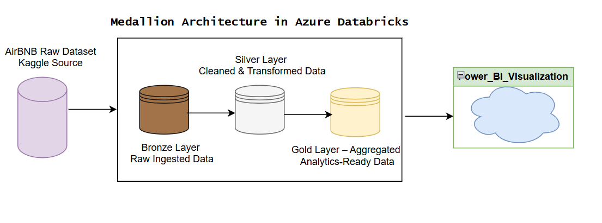
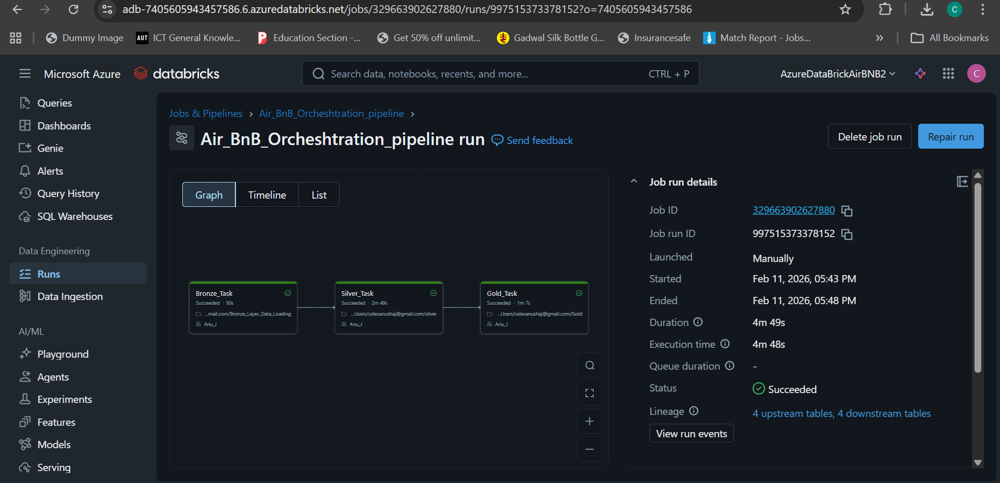
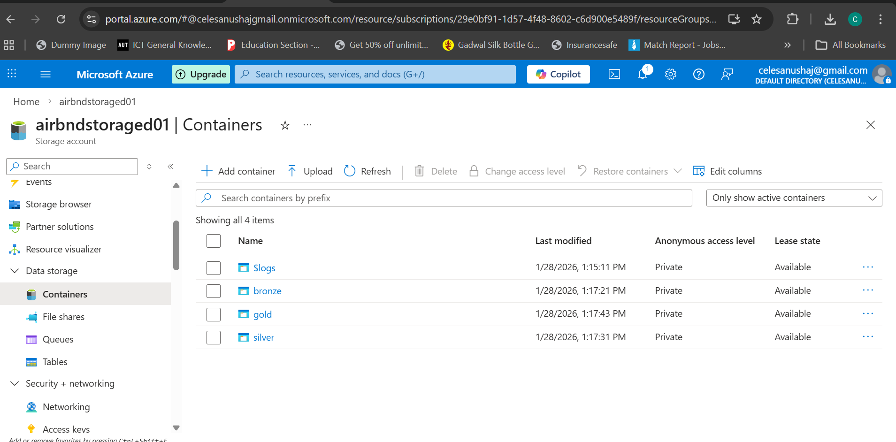
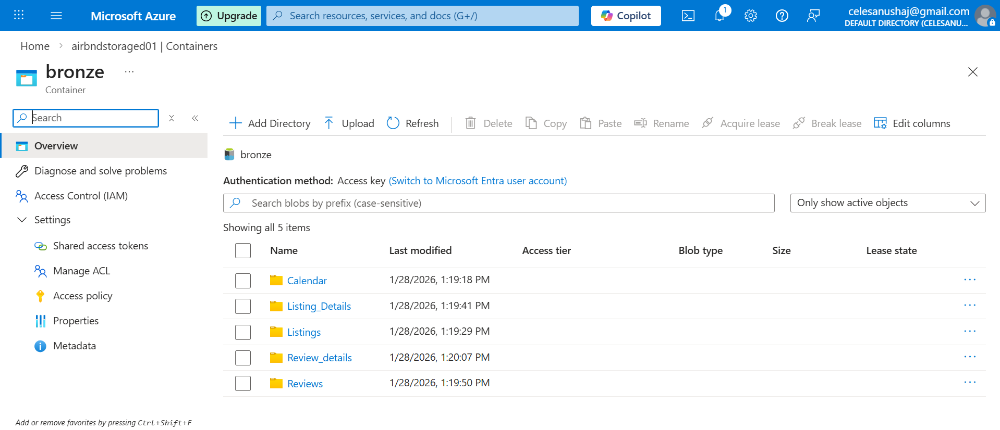
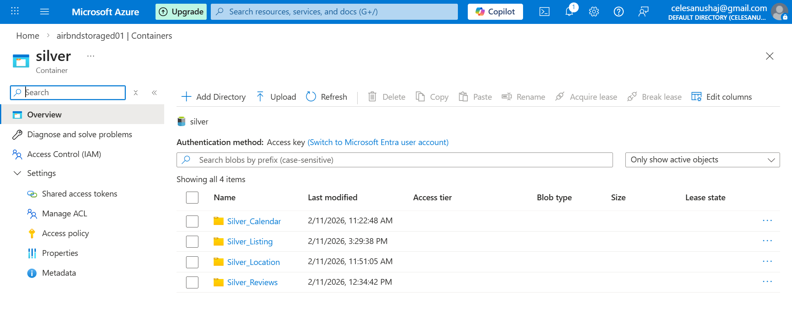

# End-to-End Airbnb Data Analysis Using Medallion Architecture in Databricks and Azure

An end-to-end data pipeline on **Azure Databricks** that ingests raw Airbnb data from Azure storage, refines it through **Bronze → Silver → Gold** layers using PySpark and Delta Lake, and serves analysis-ready tables to Power BI dashboards. The three layers are orchestrated as a single Databricks Job.

---

## Architecture



| Layer | Purpose | Key operations |
|---|---|---|
| **Bronze** | Raw data, preserved as ingested | CSV ingestion into Delta tables |
| **Silver** | Clean, consistent, typed data | Null handling, date formatting, numeric type conversions |
| **Gold** | Business-ready aggregates | Summary tables for calendar, listings, reviews and location |

---

## Tech Stack

- **Azure Databricks** >> PySpark, Delta Lake, Databricks Jobs
- **Azure Storage** >> containers for each Medallion layer
- **Python** and **SQL** >> transformations and queries
- **Power BI** >> dashboards and visualisation

---

## Dataset

- **Source:** Airbnb listing data (listings, calendar, reviews)

---

## Pipeline Orchestration

The pipeline runs as a Databricks Job, **`Air_BnB_Orchestration_pipeline`**, with three dependent tasks:

```
Bronze_Task  ──►  Silver_Task  ──►  Gold_Task
```

- Each task runs its own notebook, and a task starts only after the one before it succeeds
- A full end-to-end run completes in about **5 minutes**
- Databricks tracks table lineage across the pipeline (4 upstream → 4 downstream tables)



---

## Pipeline Workflow

### 1. Storage Containers
Raw and processed data are organised in separate Azure storage containers for each layer.



### 2. Bronze -> Ingest
Raw Airbnb CSVs are loaded into Bronze Delta tables without changes.



### 3. Silver -> Clean & Transform
Nulls are removed, dates standardised and numeric fields converted into typed Silver tables.



### 4. Gold -> Aggregate
Summarised Gold tables are built for analysis and reporting.

### 5. Visualise
Power BI connects to the Gold tables for dashboards covering:
- Calendar (availability and pricing over time)
- Listings summary
- Reviews
- Location

---


## Repository Structure

```
.
├── architecture_diagram/      # End-to-end architecture diagram
├── medallion_architecture/
│   ├── containers/            # Azure storage container setup
│   ├── bronze/                # Raw ingested data
│   └── silver/                # Cleaned and transformed data
├── pipeline/                  # Databricks Job orchestration
├── notebooks/                 # PySpark notebooks for ETL
└── README.md
```

---

## How to Run

1. Create the Azure storage containers and upload the raw Airbnb CSVs
2. Import the notebooks into an Azure Databricks workspace and update the storage paths
3. Create a Databricks Job with three tasks: Bronze → Silver → Gold
4. Run the job, then connect Power BI to the Gold tables

---

